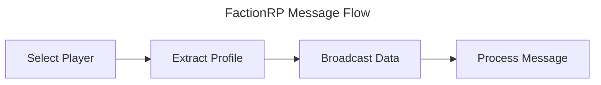

# FactionRP

_FactionRP_ is a continuation of the original CrossRP AddOn for World of Warcraft.

It attempts to pull data across faction boundaries by leveraging people's Battle.NET connections.
The more people are connected and using this AddOn, the more data can be shared.

Unlike CrossRP, the AddOn does not designate people as "servers", but tries to utilize the ingame
communication possibilities to spread information.

## Communication Structure



### Select Player

When a player is "selected", their profile is extracted and stored in the internal
database of the AddOn. A player is considered "selected" when the mouse hovers over someone,
or someone is selected as target.

### Extract Profile

A player's profile will be extracted from the supported AddOns. (Initially TRP3)
Since every player has a unique GUID in the game, we use that GUID to store the profile.
We can also use the same GUID to look up a profile, allowing the AddOn to display the profile when data is available.

### Broadcast Data

Every time we store/refresh a profile in our cache, we will broadcast that data.
This is done in the following approach:

* Scan our battle.net connections and online friends.
* If they are online, send them a AddOn Battle.NET message (see message structure)
* The receivers store the data in their own cache and propagate the information further through their own battle.net connections and friends as well as group/raid.
* They do not send the message to the broadcaster to avoid loops.

### Message Structure

Because we're dealing with Lua and limitations imposed by the World of Warcraft client,
we keep our messages scoped to the minimum data. 
We use `||` as separator, as this does not conflict with most AddOns.

**structure**:
```
SENDER-PLAYER-GUID||SUBJECT-PLAYER-GUID||SUBJECT-NAME-REALM||SOURCE-ADDON||ORIGIN-TIME||CONTENT-VERSION||PROFILE-DATA
```

* `SUBJECT-NAME-REALM` is required because a GUID alone cannot be resolved to a character
  name for players who are not in our vicinity. The supported RP AddOns (e.g. TRP3) key their
  data store by `Name-Realm`, so we must carry it to be able to display the profile later.
* `SOURCE-ADDON` is the AddOn the profile originated from (e.g. `TRP3`), so the receiver knows
  which adapter to use.
* `ORIGIN-TIME` is the server `time()` captured by the client that originally extracted the
  profile from its real (local) RP AddOn data. It is the ordering key: a copy with a newer
  origin-time always supersedes an older one. Relayers never modify it — they propagate the
  origin's value unchanged.
* `CONTENT-VERSION` identifies the profile content. For TRP3 it is the combination of its
  per-section version counters (`.v`). Because those counters wrap (1..99) and are not globally
  ordered, content-version is only ever compared for *equality* (to detect "same vs changed");
  `ORIGIN-TIME` provides the actual ordering. Together they de-duplicate gossip (see Broadcast
  Flow) and prevent stale and fresh copies from flapping between mutual peers.

Because a single in-game AddOn message is capped at 255 bytes, larger profiles are split into
numbered chunks and re-assembled by the receiver before processing.

### Broadcast Flow
This section illustrates what happens when a message needs to be broadcast:

* When not in a party/raid: 
  * Broadcast the data through the AddOn Comm Channel to share with same faction users
  * Broadcast the data through Battle.NET friends
  * Broadcast the data through friends
* when in a part/raid:
  * Same as alone + broadcast through party/raid AddON messaging.

The "AddOn Comm Channel" is a hidden chat channel (joined via `JoinTemporaryChannel`) over which
same-faction clients exchange addon messages. Cross-faction sharing is only possible over the
Battle.NET connections.

A message should be ignored when any of the following is true:

* The sender GUID is the same as the user's GUID (loop avoidance).
* We already hold the subject's profile with the same `CONTENT-VERSION`, or with an `ORIGIN-TIME`
  newer than the incoming message (de-duplication / staleness rejection). We only store and
  re-broadcast when the content differs *and* the incoming copy is not older.

When re-broadcasting, we never send the message back toward the peer we received it from.

### Cache Structure

The cache needs to do a little bit more than just track the GUID and Profile.
It needs to track the following data:

* The GUID of the player who's profile is stored (cache key)
* The `Name-Realm` of that player (needed to display/inject the profile)
* When the entry was added locally (drives the 5 minute TTL / expiry)
* The `ORIGIN-TIME` and `CONTENT-VERSION` of the profile (used for ordering and de-duplication)
* The AddOn of the profile, e.g. TRP3 or something
* The actual Profile data

### Tooltip update

The AddOn needs to rebuild tooltips for players of the opposite faction.
If the player of the opposite faction has an entry in our cache, load it and apply it.
For this we can probably leverage the functionality of TRP3 to achieve the same result.

In practice this means: when an opposite-faction unit is hovered/targeted and we hold a cached
profile for their GUID, we inject that data into TRP3's own register (keyed by `Name-Realm`) via
its public API (`addCharacter` → `saveCurrentProfileID` → `saveInformation`, gated by
`shouldUpdateInformation`). TRP3 then renders the tooltip itself, so we do not maintain a separate
tooltip implementation. Injected entries are treated as transient and respect the 5 minute TTL.

### Slash Commands

All commands are available under `/factionrp` or the shorter alias `/frp`.
Running the base command with no (or an unrecognised) sub-command prints the usage list.

* `/factionrp status` — Show the version, number of cached profiles, the active RP adapter
  (e.g. TRP3) and whether debug mode is on.
* `/factionrp debug` — Toggle debug mode on/off (see below).

### Debug Mode

The `/factionrp debug` command enables/disables debug mode.
In debug mode, a message is printed out every time the following happens:

* A broadcast is sent, including target GUID
* A message is received, including sender GUID
* A profile is stored in the cache
* A profile is refreshed in the cache

### Additional Plans

These points are to be kept in consideration, but will not be part of the current v1 release:

* Ability to load/store additional data such as TRP3 about pages
* Ability to track which battle.net/friend connection sent us the data
* Use the previous point to fetch profiles on demand when they are online.

### AddOn documentation

* [World of Warcraft API](https://warcraft.wiki.gg/wiki/World_of_Warcraft_API)
* [Lua Functions](https://warcraft.wiki.gg/wiki/Lua_functions)
* [Widget API](https://warcraft.wiki.gg/wiki/Widget_API)
* [Events](https://warcraft.wiki.gg/wiki/Events)
* [CVARS](https://warcraft.wiki.gg/wiki/Console_variables)